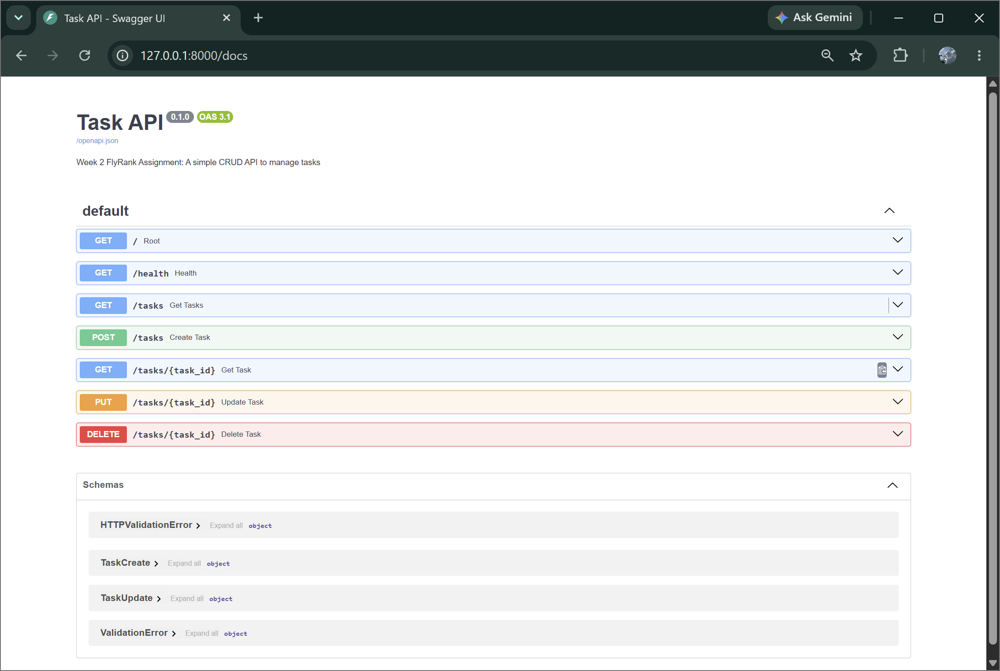

# Task API

A simple CRUD (Create, Read, Update, Delete) REST API built with FastAPI for managing tasks in memory. This project was developed as part of the FlyRank Backend Internship Week 2 Assignment.

## Features

* Create new tasks
* Retrieve all tasks
* Retrieve a task by ID
* Update existing tasks
* Delete tasks
* Input validation
* Proper HTTP status codes
* Interactive Swagger UI documentation

## Tech Stack

* Python 3.10+
* FastAPI
* Uvicorn

## Project Structure

```text
task-api/
│
├── main.py
├── requirements.txt
├── README.md
├── .gitignore
└── screenshots/
    └── swagger-ui.png
```

## Installation

### Clone the Repository

```bash
git clone https://github.com/your-username/task-api.git
cd task-api
```

### Create a Virtual Environment

```bash
python -m venv venv
```

### Activate the Environment

**Windows**

```bash
venv\Scripts\activate
```

**Linux / macOS**

```bash
source venv/bin/activate
```

### Install Dependencies

```bash
pip install -r requirements.txt
```

## Run the Application

```bash
uvicorn main:app --reload
```

Server will start at:

```text
http://localhost:8000
```

## API Documentation

Swagger UI:

```text
http://localhost:8000/docs
```

ReDoc:

```text
http://localhost:8000/redoc
```

## Sample Task Object

```json
{
  "id": 1,
  "title": "Study FastAPI",
  "done": false
}
```

## Endpoints

| Method | Endpoint    | Description      |
| ------ | ----------- | ---------------- |
| GET    | /           | API information  |
| GET    | /health     | Health check     |
| GET    | /tasks      | Get all tasks    |
| GET    | /tasks/{id} | Get a task by ID |
| POST   | /tasks      | Create a task    |
| PUT    | /tasks/{id} | Update a task    |
| DELETE | /tasks/{id} | Delete a task    |

## Example Requests

### Get All Tasks

```bash
curl -i http://localhost:8000/tasks
```

### Create a Task

```bash
curl -i -X POST http://localhost:8000/tasks \
-H "Content-Type: application/json" \
-d '{"title":"Study FastAPI"}'
```

### Update a Task

```bash
curl -i -X PUT http://localhost:8000/tasks/1 \
-H "Content-Type: application/json" \
-d '{"title":"Updated Task","done":true}'
```

### Delete a Task

```bash
curl -i -X DELETE http://localhost:8000/tasks/1
```

## Example Response

```http
HTTP/1.1 201 Created
content-type: application/json

{
  "id": 1,
  "title": "Study FastAPI",
  "done": false
}
```

## Status Codes

| Status Code | Meaning            |
| ----------- | ------------------ |
| 200         | Successful request |
| 201         | Resource created   |
| 204         | Resource deleted   |
| 400         | Invalid input      |
| 404         | Resource not found |

## Error Response Example

```json
{
  "error": "Task 99 not found"
}
```

## Swagger UI Screenshot

```markdown

```

## Notes

* Tasks are stored in memory.
* Data will be lost when the server restarts.
* No database is used in this version.

## Author

Created as part of the FlyRank Backend Internship – Week 2 Assignment.
