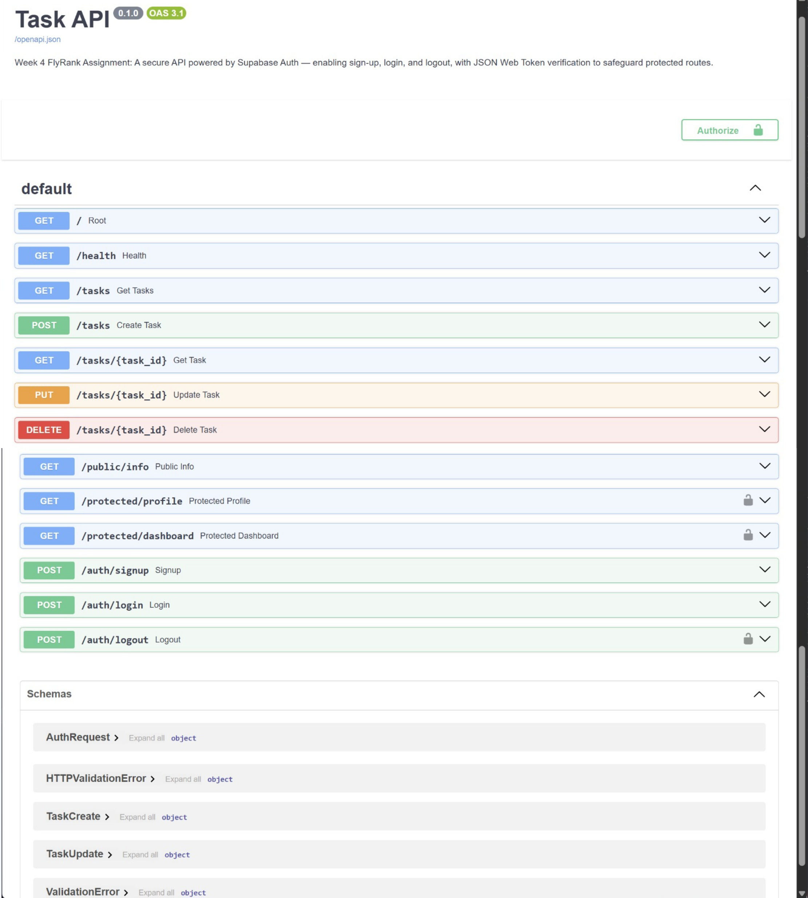

# Auth API

A secure REST API built with FastAPI and Supabase Auth for user authentication and protected routes.
* FlyRank Backend AI Engineering Internship - Week 4 Assignment: Auth - Login & Protect.

---
# Overview

The API supports user sign-up, login, logout, JWT verification, protected routes, reusable authentication dependencies, and Swagger UI with Bearer token authentication.

#### Supabase handles user accounts, password hashing, and JWT issuance. The backend verifies the access tokens provided by authenticated users.
---
# Features

| Feature | Description |
|----------|-------------|
| User Sign Up | Creates a new user account through Supabase Auth |
| User Login | Authenticates a user and returns an access token |
| User Logout | Ends the authenticated user's session |
| JWT Verification | Verifies access tokens using Supabase |
| Request Validation | Validates required authentication fields |
| Protected Routes | Restricts access to authenticated users |
| Auth Dependency | Reusable authentication guard for protected routes |
| Public Route | Provides publicly accessible information |
| Environment Variables | Supabase credentials stored in .env |
| Swagger Documentation | Interactive API documentation and with Bearer authentication |

---
## Tech Stack


[](https://pydantic.dev/docs/validation/latest/get-started/contributing/#badges)

| Technology | Purpose |
|------------|---------|
| Python | Programming Language |
| FastAPI | Backend Framework |
| Supabase Auth | Identity Provider and Authentication |
| JWT | Access Token Authentication |
| Python-dotenv | Environment Configuration |
| Uvicorn | ASGI Server |
| Pydantic | Request Validation |

## Project Structure

```text
task-api/
│
├── main.py
├── database.py
├── Dockerfile
├── compose.yaml
├── .env.example
├── .env                 # Git-ignored
├── requirements.txt
├── README.md
├── .gitignore
└── screenshots/
    ├── swagger-ui.png
    ├── psql-db.png
    ├── W4-authlogin-swagger.jpeg
```
# Environment Configuration

Create a `.env` file using `.env.example`.

```env
SUPABASE_URL=your_project_url
SUPABASE_KEY=your_anon_key
PORT=8000
```
The `.env` file is excluded from Git using `.gitignore`.

The Supabase `anon` key is used by the application. The `service_role` key is not used.


# Running the Application

Follow these steps to run the stack using Docker Compose.

### 1. Clone the Repository

```bash
git clone https://github.com/faizahsharieff/flyrank-backend-track.git
cd task-api
```

### 2. Configure Environment Secrets
Copy `.env.example` to create your local `.env` file:

```bash
cp .env.example .env
```
Configure the required Supabase and application settings in `.env`.

### 3. Start the application
```bash
docker compose up
```
This starts:

* FastAPI application
* PostgreSQL database
---
The API will be available at:

```text
http://localhost:8000
```

### 4. Stop the application
```bash
docker compose down
```

## API Documentation

Swagger UI:

```text
http://localhost:8000/docs
```
The protected endpoints use Bearer authentication through Swagger's Authorize button.


---

# API Endpoints

| Method | Endpoint | Description | Authentication |
| :----: | -------- | ----------- | :-------: |
| GET | `/public/info` | Returns public information | No |
| GET | `/protected/profile` | Returns authenticated user information | Yes |
| GET | `/protected/dashboard` | Returns protected dashboard information | Yes |
| POST | `/auth/signup` | Creates a new user account | No |
| POST | `/auth/login` | Authenticates a user and returns a JWT | No |
| POST | `/auth/logout` | Logs out the authenticated user | Yes |

---

# Status Codes
| Status Code	| Meaning |
| :----------: | ------------|
| 200	| Successful request |
| 201	| User successfully created |
| 204	| Successful logout |
| 400	| Missing or invalid input |
| 401	| Missing, invalid, or expired access token |

---

# Authentication

Protected endpoints require an access token in the following format:

Authorization: Bearer `<access_token>`

Invalid, expired, missing, or malformed tokens return `401 Unauthorized`.

---
# API Documentation Preview

---

# Application Flow

```text
                    User / Client
                         │
                         ▼
                 FastAPI Application
                         │
              ┌──────────┴──────────┐
              │                     │
              ▼                     ▼
        Public Routes          Auth Routes
       /public/info       /auth/signup /auth/login
                                    │
                                    ▼
                              Supabase Auth
                                    │
                                    ▼
                              JWT Access Token
                                    │
                                    ▼
                            Authorization Header
                            Bearer <access_token>
                                    │
                                    ▼
                          Authentication Guard
                                    │
                         ┌──────────┴──────────┐
                         │                     │
                    Invalid Token         Valid Token
                         │                     │
                         ▼                     ▼
                  401 Unauthorized      Protected Routes
                                      /protected/profile
                                      /protected/dashboard
                                      /auth/logout
```
---

# Testing

The API was verified across both success and failure paths:

1. Sign-up & Login: Tested via `curl` and Swagger UI; received valid JWTs.
2. Protected Route Verification: Verified with valid bearer tokens returning HTTP `200`.
3. Guard Testing: Verified missing, malformed, or altered tokens return HTTP `401 Unauthorized`.
4. Session Termination: Verified `/auth/logout` returns HTTP `204 No Content`.