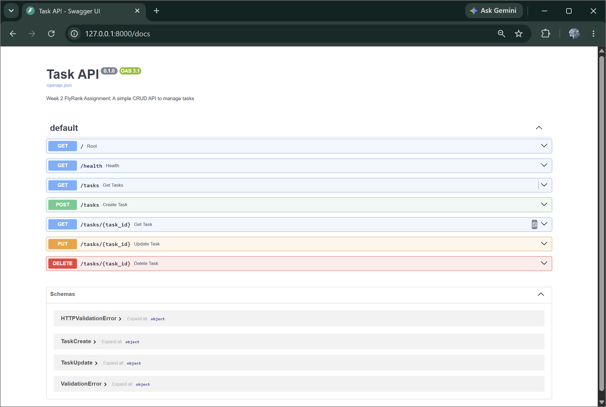
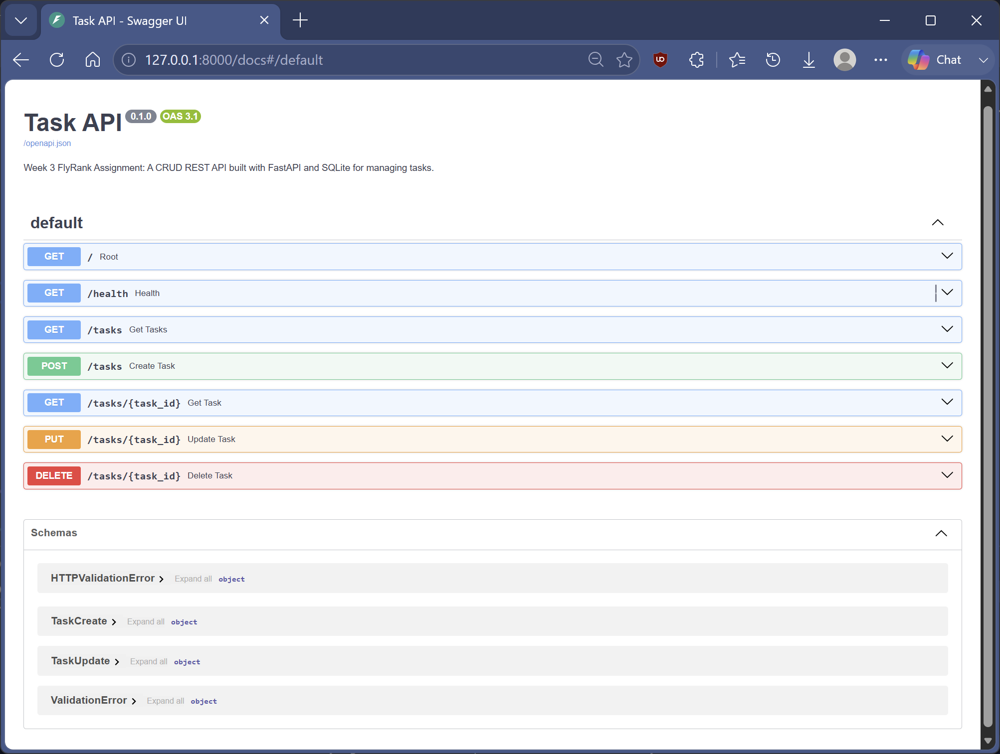
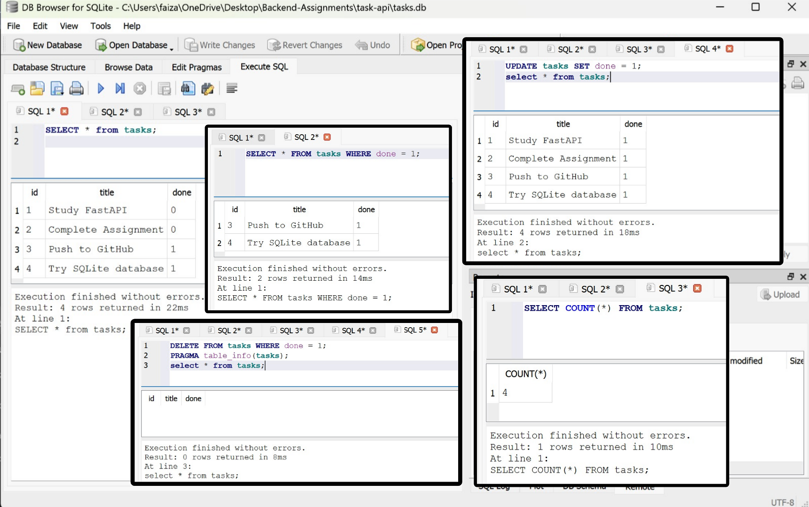

# Task API

A CRUD (Create, Read, Update, Delete) REST API built with FastAPI and SQLite for managing tasks.
* FlyRank Backend AI Engineering Internship - Week 3 Assignment: Connecting CRUD to a database.

---
# Overview

The Task API is a RESTful API built with FastAPI and SQLite for managing tasks.

Unlike the previous in-memory implementation, task data is stored in a SQLite database (`tasks.db`), allowing data to persist across application restarts.

#### The API supports full CRUD operations, request validation using Pydantic, automatic database initialization, and interactive documentation through Swagger UI.
---
# Features

| Feature | Description |
|----------|-------------|
| RESTful API | Implements CRUD operations using HTTP methods |
| Create Tasks | Add new tasks |
| Read Tasks | Retrieve all tasks or a specific task |
| Update Tasks | Modify an existing task |
| Delete Tasks | Remove tasks from the database |
| Request Validation | Validates incoming request data using Pydantic |
| Error Handling | Returns appropriate HTTP status codes and messages |
| Swagger Documentation | Interactive API documentation and testing |
| SQLite Storage | Stores tasks persistently in a database |
| Auto Database Setup | Automatically creates database and tables |
| Seed Data | Inserts sample tasks on first run only |

---
# Why SQLite?

## SQLite was chosen because it is:

- Lightweight and serverless
- Easy to set up and use
- Stored in a single file (`tasks.db`)
- Suitable for small applications and local development
- Persistent across application restarts

Unlike in-memory storage, SQLite ensures that created tasks remain available even after restarting the FastAPI server.


## Tech Stack


[](https://pydantic.dev/docs/validation/latest/get-started/contributing/#badges)
| Technology | Purpose |
|------------|---------|
| Python | Programming Language |
| FastAPI | Backend Framework |
| SQLite3 | Database |
| Uvicorn | ASGI Server |
| Pydantic | Request Validation |

## Project Structure

```text
task-api/
│
├── main.py
├── database.py
├── requirements.txt
├── README.md
├── .gitignore
└── screenshots/
    ├── swagger-ui.png
    └── db-browser.png
```

# Running the Application

Follow these steps to run the project locally.

| Step | Command / Action |
|---------|----------------|
| **1. Activate Virtual Environment** | `.\venv\Scripts\activate` |
| **2. Install Dependencies** | `pip install -r requirements.txt` |
| **3. Start the Server** | `uvicorn main:app --reload` |
| **4. Open Swagger UI** | `http://127.0.0.1:8000/docs` |

### Clone the Repository

```bash
git clone https://github.com/faizahsharieff/flyrank-backend-track.git
cd task-api
```

### Create a Virtual Environment

```bash
python -m venv venv
```

### Activate the Environment

**Windows**

```bash
venv\Scripts\activate
```

**Linux / macOS**

```bash
source venv/bin/activate
```

### Install Dependencies

```bash
pip install -r requirements.txt
```

## Run the Application

```bash
uvicorn main:app --reload
```

Server will start at:

```text
http://localhost:8000
```

## API Documentation

Swagger UI:

```text
http://localhost:8000/docs
```

ReDoc:

```text
http://localhost:8000/redoc
```

# Automatic Database Setup

When the application starts:

1. `tasks.db` is created automatically if it does not exist.
2. The `tasks` table is created automatically if it does not exist.
3. Three sample tasks are seeded into the database.
4. Seed data is inserted only when the table is empty.

This prevents duplicate seed data from being created on every restart.

---

# Database Schema

| Column | Type | Description |
|----------|----------|-------------|
| id | INTEGER | Primary Key, Auto Increment |
| title | TEXT | Task title |
| done | INTEGER | Completion status (0 or 1) |

---

# API Endpoints

| Method | Endpoint | Description |
| :----: | -------- | ----------- |
| GET | `/` | Returns API information |
| GET | `/health` | Returns the health status of the application |
| GET | `/tasks` | Retrieves all tasks |
| GET | `/tasks/{id}` | Retrieves a task by its ID |
| POST | `/tasks` | Creates a new task |
| PUT | `/tasks/{id}` | Updates an existing task |
| DELETE | `/tasks/{id}` | Deletes a task |

---

# Example Requests

## Create a Task

### Request Body

```json
{
  "title": "Complete SQLite Assignment"
}
```

### Response

```json
{
  "id": 4,
  "title": "Complete SQLite Assignment",
  "done": false
}
```

---

## Update a Task

### Request Body

```json
{
  "title": "Submit Assignment",
  "done": true
}
```

### Response

```json
{
  "id": 1,
  "title": "Submit Assignment",
  "done": true
}
```

---

## Get All Tasks

### Response

```json
[
  {
    "id": 1,
    "title": "Study FastAPI",
    "done": false
  },
  {
    "id": 2,
    "title": "Complete Assignment",
    "done": false
  },
  {
    "id": 3,
    "title": "Push to GitHub",
    "done": true
  }
]
```

---

## Get Task by ID

### Response

```json
{
  "id": 1,
  "title": "Study FastAPI",
  "done": false
}
```

---

## Delete a Task

### Response

```text
204 No Content
```

---

# Example SQL Queries

## Retrieve All Tasks

```sql
SELECT * FROM tasks;
```

## Count Tasks

```sql
SELECT COUNT(*) FROM tasks;
```

## Retrieve Completed Tasks

```sql
SELECT * FROM tasks WHERE done = 1;
```

## Output on retrieval :

|id|title|done|
|-----|-------|------|
|3|Push to GitHub|1|
|4|Try SQLite Database |1|


These queries were tested using **DB Browser for SQLite**.

---

# Persistence Verification

SQLite persistence was verified by:

1. Creating a task using `POST /tasks`
2. Restarting the FastAPI server
3. Calling `GET /tasks`
4. Confirming the task still exists

This demonstrates that data survives server restarts.

---
# API Documentation Preview


# DB Browser for SQLite 


---

# Application Flow

```text
                    User / Client
                          │
                          ▼
                     HTTP Request
                          │
                          ▼
                 FastAPI Application
                      (main.py)
                          │
          ┌───────────────┼───────────────┐
          │               │               │
          ▼               ▼               ▼
   Validate Request   Process Request   Execute SQL
      (Pydantic)                          Query
          │               │                │
          └───────────────┼────────────────┘
                          ▼
                   SQLite Database
                      (tasks.db)
                          │
                          ▼
                    HTTP Response
                          │
                          ▼
                 Browser / Swagger UI
```

---

# Testing

The API was tested using:

- Swagger UI
- curl commands
- DB Browser for SQLite
- Manual CRUD verification

All CRUD operations were successfully verified against the SQLite database.

---

# Notes
- Seed data runs only once.
- Parameterized SQL queries are used to help prevent SQL injection.