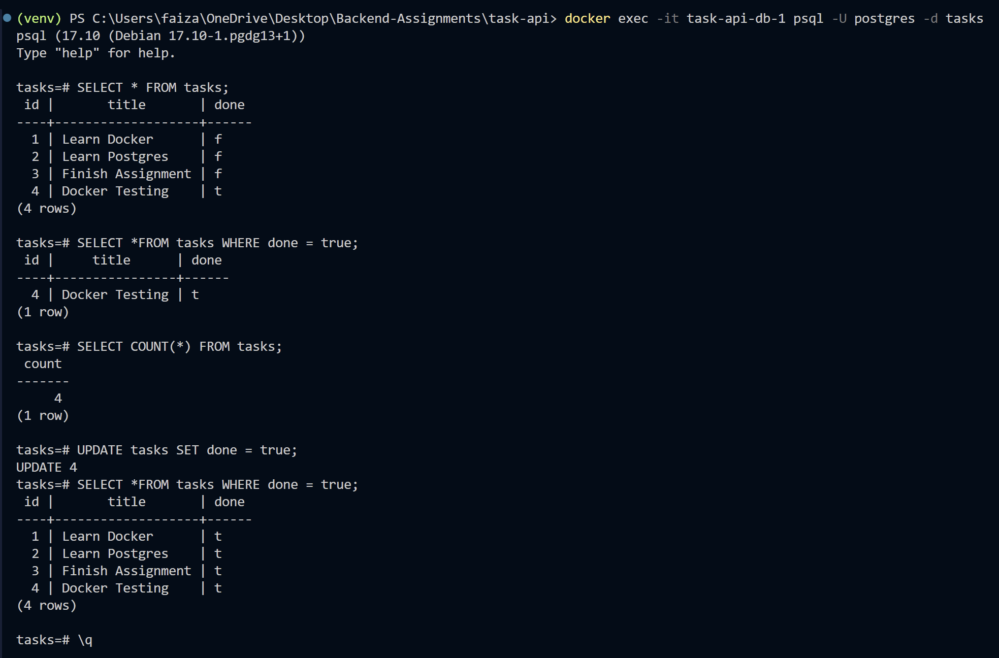

# Task API

A CRUD (Create, Read, Update, Delete) REST API built with FastAPI and PostgreSQL for managing tasks.
* FlyRank Backend AI Engineering Internship - Week 3 Assignment: Containerize your stack & connect CRUD to Postgres.

---
# Overview

The Task API is a RESTful API built with FastAPI and PostgreSQL.

Unlike previous in-memory or SQLite implementations, task data is stored in a containerized PostgreSQL database server, allowing data to persist across container restarts using Docker volumes.

#### The API supports full CRUD operations, request validation using Pydantic, automatic database initialization, and interactive documentation through Swagger UI.
---
# Features

| Feature | Description |
|----------|-------------|
| RESTful API | Implements CRUD operations using HTTP methods |
| Create Tasks | Add new tasks |
| Read Tasks | Retrieve all tasks or a specific task |
| Update Tasks | Modify an existing task |
| Delete Tasks | Remove tasks from the database |
| Request Validation | Validates incoming request data using Pydantic |
| Error Handling | Returns appropriate HTTP status codes and messages |
| Parameterized Queries | Prevents SQL injection using driver placeholders (`%s` / `$1`) |
| PostgreSQL Storage | Stores tasks persistently in a Dockerized PostgreSQL database server |
| Docker & Compose | Whole stack (API + DB) starts with a single command (`docker compose up`) |
| Secrets via `.env` | Environment secrets managed securely with `.env` (git-ignored) and `.env.example` |
| Swagger Documentation | Interactive API documentation and testing |
| Auto Database Setup | Automatically creates table and seeds initial tasks on first boot |
| Persistence | Data survives container restarts using Docker named volumes |

---
# Why PostgreSQL & Docker?
PostgreSQL in Docker was chosen because:

- **Industry Standard:** PostgreSQL is a robust, production-grade relational database server.
- **Environment Isolation:** Docker containers eliminate "works on my machine" issues by running standard images.
- **One-Command Setup:** `docker compose up` spins up both the API and database services automatically.
- **Persistence via Volumes:** Named Docker volumes keep database rows safe even if containers are destroyed.
- **Config via Environment:** Database credentials are provided via `.env` without hardcoding secrets.

---

## Tech Stack


[](https://pydantic.dev/docs/validation/latest/get-started/contributing/#badges)

| Technology | Purpose |
|------------|---------|
| Python | Programming Language |
| FastAPI | Backend Framework |
| PostgreSQL | Relational Database Engine |
| Psycopg / SQLModel | Database Driver / ORM |
| Docker & Docker Compose | Containerization & Orchestration |
| Uvicorn | ASGI Server |
| Pydantic | Request Validation |

## Project Structure

```text
task-api/
│
├── main.py
├── database.py
├── Dockerfile
├── compose.yaml
├── .env.example
├── .env                 # Git-ignored
├── requirements.txt
├── README.md
├── .gitignore
└── screenshots/
    ├── swagger-ui.png
    └── psql-db.png
```

# Running the Application

Follow these steps to run the stack using Docker Compose.

### 1. Clone the Repository

```bash
git clone https://github.com/faizahsharieff/flyrank-backend-track.git
cd task-api
```

### 2. Configure Environment Secrets
Copy `.env.example` to create your local `.env` file:

```bash
cp .env.example .env
```
Ensure your `.env` contains the required database settings: 
```env
DATABASE_URL=postgresql://postgres:dev@db:5432/tasks
```
### 3. Start the application
```bash
docker compose up
```
This starts:

* FastAPI application
* PostgreSQL database
* Database volume for persistent storage
---
The API will be available at:

```text
http://localhost:8000
```

### 4. Stop the application
```bash
docker compose down
```

## API Documentation

Swagger UI:

```text
http://localhost:8000/docs
```

# Database Schema

| Column | Type | Description |
|----------|----------|-------------|
| id | INTEGER | Primary Key |
| title | TEXT | Task title |
| done | BOOLEAN | Completion status |

---

# API Endpoints

| Method | Endpoint | Description |
| :----: | -------- | ----------- |
| GET | `/` | Returns API information |
| GET | `/health` | Returns the health status of the application |
| GET | `/tasks` | Retrieves all tasks |
| GET | `/tasks/{id}` | Retrieves a task by its ID |
| POST | `/tasks` | Creates a new task |
| PUT | `/tasks/{id}` | Updates an existing task |
| DELETE | `/tasks/{id}` | Deletes a task |

---

# Example Requests

## Create a Task

### Request Body

```json
{
  "title": "Complete Docker Assignment"
}
```

### Response

```json
{
  "id": 4,
  "title": "Complete Docker Assignment",
  "done": false
}
```

---

## Update a Task

### Request Body

```json
{
  "title": "Submit Assignment",
  "done": true
}
```

### Response

```json
{
  "id": 1,
  "title": "Submit Assignment",
  "done": true
}
```

---

## Get All Tasks

### Response

```json
[
  {
    "id": 1,
    "title": "Study FastAPI",
    "done": false
  },
  {
    "id": 2,
    "title": "Complete Assignment",
    "done": false
  }
]
```
---

## Get Task by ID

### Response

```json
{
  "id": 1,
  "title": "Study FastAPI",
  "done": false
}
```
---
# Persistence

Task data is stored in PostgreSQL using a Docker named volume, ensuring that data remains available even after containers are stopped or recreated.

---
# Database Preview

# API Documentation Preview

---

# Application Flow

```text
                User / Client
                      │
                      ▼
                 HTTP Request
                      │
                      ▼
              FastAPI Application
                   (main.py)
                      │
          Validate Request (Pydantic)
                      │
                      ▼
             PostgreSQL Database
              (Docker Container)
                      │
                      ▼
                HTTP Response
                      │
                      ▼
              Browser / Swagger UI
```
---

# Testing

The API was tested using:

- Swagger UI
- curl commands
- PostgreSQL
- Manual CRUD verification

All CRUD operations were successfully verified against the PostgreSQL database.

## cURL Test

Create a new task:

```bash
curl.exe -i -X POST http://localhost:8000/tasks -H "Content-Type: application/json" -d "{\"title\":\"Learn Docker\"}"
```
Expected response:

```json
{
  "id": 4,
  "title": "Learn Docker",
  "done": false
}
```
---

# Notes
- Database tables are created automatically on startup.
- Parameterized SQL queries are used to help prevent SQL injection.
- Environment variables are managed using a `.env` file.
- Docker volumes provide persistent database storage.